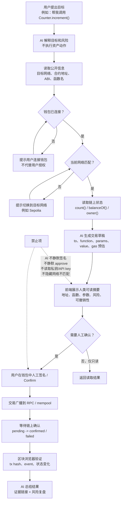

# Task: AI x Web3 最小交叉流程图

- **WCB Task ID**: `cmp3jyrc507sin301kjhy1mwf`
- **WCB Task Title**: Week 1｜AI × Web3 综合任务｜画出 AI × Web3 最小交叉流程图
- **Points**: 30
- **Submitted**: 待提交
- **Handbook 关联章节**:
  - [开发栈（Dev Stack）](https://aiweb3.school/zh/handbook/web3/dev-stack/)
  - [钱包（Wallet）](https://aiweb3.school/zh/handbook/web3/wallet/)
  - [智能合约（Smart Contract）](https://aiweb3.school/zh/handbook/web3/smart-contract/)

## 一句话总结

这个流程图描述一个最小 AI Agent 调用 Web3 合约的安全边界：AI 可以解释意图、读取 ABI、生成交易草稿和总结链上证据，但钱包签名、授权、付款和任何改变链上状态的动作必须由用户人工确认。

## 流程图

## 这个流程解决什么问题

AI x Web3 的核心风险不是 AI 会不会“懂合约”，而是 AI 是否会在用户没看懂时继续推进资产动作。这个流程把一次合约交互拆成读信息、检查环境、生成草稿、人工确认、链上验证五段，避免把“AI 建议”和“链上执行”混在一起。

## AI / Agent 辅助哪些步骤

AI 可以辅助：

- 解释用户目标，判断是读操作、写操作还是授权操作。
- 读取和解释合约 ABI，说明函数名、参数和返回值。
- 检查目标网络、合约地址、钱包连接状态和前端配置是否一致。
- 生成交易草稿，包括 `to` 地址、函数、参数、`value` 和风险说明。
- 根据 tx hash / event / Blockscout 页面总结最终结果。

AI 不应该静默执行：

- 钱包签名。
- 任何消耗 gas 的交易。
- `approve` / `permit` / `setApprovalForAll` 等授权。
- owner 权限转移、合约升级、资金转移。
- 读取或使用私钥、助记词、API key、`.env`。

## 哪些步骤必须人工确认

| 步骤 | 为什么必须人工确认 |
|---|---|
| 连接钱包 | 钱包连接会暴露地址和网络环境，应由用户主动确认 |
| 切换网络 | 不同网络是不同执行环境，错误网络可能导致误操作 |
| 签名消息 | 签名可能被用于身份认证或授权，不能默认安全 |
| 发交易 / 调写函数 | 改变链上状态且可能消耗 gas，成功后不可撤回 |
| approve / permit | 授权可能允许第三方未来转走资产，是高风险动作 |
| owner / admin 操作 | 可能改变合约权限边界或资产控制权 |

## 如何验证最终结果

最小验证路径：

1. 前端或脚本拿到 tx hash。
2. 在 Blockscout / Etherscan 查询交易是否成功。
3. 检查 `to` 地址是否为目标合约。
4. 检查 decoded input 是否为预期函数和参数。
5. 检查 event 是否发出，例如 `CountChanged` / `Transfer` / `Deposit`。
6. 再读一次链上状态，例如 `count()` 或 `balanceOf(address)`，确认状态变化符合预期。

## 主要风险点

| 风险 | 例子 | 防护 |
|---|---|---|
| 网络不匹配 | 前端配置 Sepolia，钱包在 Mainnet | 前端必须提示切换网络，禁止继续写交易 |
| 合约地址错误 | 用户以为调用 Counter，实际调用未知合约 | 地址版本化，展示合约地址和区块浏览器链接 |
| ABI 不匹配 | 前端编码参数错误，交易 revert 或调用错误函数 | ABI 版本化，使用 verified 合约和类型检查 |
| AI 过度自动化 | Agent 直接替用户 approve unlimited | 资产动作前强制人工确认 |
| 签名语义不清 | 用户不知道自己签的是登录、授权还是交易 | 钱包 / 前端展示人类可读摘要 |
| 结果未验证 | UI 显示成功但链上失败 | 用 tx hash、event、状态读取做二次验证 |

## 关联学习

- 关联 daily note：[`daily/2026-05-24.md`](../daily/2026-05-24.md)、[`daily/2026-05-25.md`](../daily/2026-05-25.md)、[`daily/2026-05-27.md`](../daily/2026-05-27.md)
- 关联任务：[`tasks/week1-deploy-or-call-contract.md`](./week1-deploy-or-call-contract.md)
- 个人方向应用：这张流程图会作为 Week 2 Wallet / Permission 方向的起点，用来继续设计 Agent 链上动作权限策略。

## AI 辅助说明

本文件由 AI 根据我的 dev-stack 学习过程、Counter / WETH9 实操记录和 WCB task 要求起草。我人工复核了核心边界：AI 只负责解释、检查、草稿和总结；签名、授权、链上交易和 secret 使用必须由人确认。
