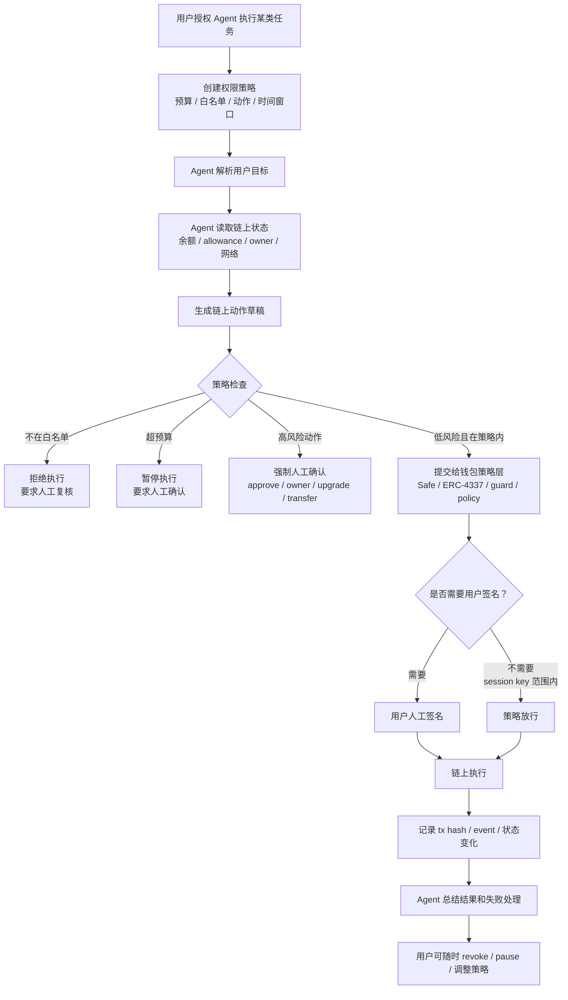

# Task: Agent 链上动作权限策略

- **WCB Task ID**: `cmpkl65h2nbggmu01i4egjtq6`
- **WCB Task Title**: Week 2｜Wallet / Permission｜Agent 链上动作权限策略
- **Points**: 20
- **Submitted**: 待提交
- **Handbook 关联章节**:
  - [Agent Wallet](https://aiweb3.school/zh/handbook/bridge/agent-wallet/)
  - [Web3 Tool Use](https://aiweb3.school/zh/handbook/bridge/web3-tool-use/)
  - [账户抽象（Account Abstraction）](https://aiweb3.school/zh/handbook/web3/account-abstraction/)
  - [安全（Security）](https://aiweb3.school/zh/handbook/web3/security/)

## 一句话总结

一个 Agent Wallet 不应该拿到用户完整私钥，而应该只拿到受限权限：预算有限、合约白名单有限、动作类型有限、时间窗口有限、超出阈值必须人工确认，并且所有执行都要可撤销、可追踪、可验证。

## 场景设定

**场景：受限 AI Web3 助手**

用户希望 Agent 帮自己做低风险链上动作，例如：

- 读取钱包余额和合约状态。
- 解释交易风险。
- 在测试网调用已知合约。
- 在小额预算内支付 API / 内容 / 工具调用费用。
- 生成交易草稿并等待用户确认。

用户不希望 Agent 能：

- 拿走 EOA 私钥。
- 随意发主网交易。
- 无限 approve。
- 调用未知合约。
- 修改 owner / admin 权限。
- 在用户不知情时花钱。

## Agent 发起链上动作执行流程

## 权限策略设计

| 维度 | 策略 | 目的 |
|---|---|---|
| 预算 | 每日最多 5 USDC；单笔最多 1 USDC；测试网不设真实资产预算 | 防止 Agent 失控花钱 |
| 可调用合约 | 只允许白名单合约，例如 WETH9、测试 Counter、指定 paywall 合约 | 防止调用恶意合约 |
| 可执行动作 | 默认只读；低风险写操作需在白名单；approve / owner / upgrade 永远人工确认 | 防止资产授权和权限变更被自动化 |
| 网络限制 | 默认只允许 Sepolia / 指定测试网；主网动作必须人工确认 | 防止网络误用 |
| 时间窗口 | session key 只在 24 小时内有效；过期自动失效 | 降低长期授权风险 |
| 人工确认阈值 | 超预算、未知合约、授权动作、资金转移、owner/admin 操作必须人工确认 | 把高风险点停在人前 |
| 撤销方式 | 用户可 revoke session key、移除白名单、暂停策略 | 给用户最终控制权 |
| 日志记录 | 记录任务、策略判断、交易草稿、tx hash、event、失败原因 | 便于复盘和追责 |
| 失败处理 | 交易失败不重试高风险动作；低风险动作最多重试 1 次；失败后要求人工确认 | 防止循环消耗 gas 或重复付款 |

## 动作风险分级

| 等级 | 动作 | Agent 权限 |
|---|---|---|
| L0 只读 | `balanceOf()`、`count()`、查 tx、查 event、读 owner | 可自动执行 |
| L1 低风险写 | 测试网 Counter `increment()`、小额测试网交互 | 策略内可执行，需记录日志 |
| L2 小额支付 | 单笔小额 USDC / x402 paywall 支付 | 预算内可执行或二次确认 |
| L3 授权类 | `approve`、`permit`、`setApprovalForAll` | 必须人工确认 |
| L4 管理类 | owner 转移、upgrade、pause/unpause、withdraw | 必须人工确认，建议多签 |
| L5 Secret 类 | 私钥、助记词、API key、`.env` | Agent 不读取、不复制、不提交 |

## 为什么 ERC-4337、Safe、guard / policy 重要

### ERC-4337

ERC-4337 让账户逻辑可编程。相比 EOA “谁有私钥谁全权控制”，智能账户可以加入：

- session key。
- spending limit。
- social recovery。
- paymaster。
- 自定义验证逻辑。

它解决的问题是：**Agent 不应该拿完整私钥，而应该拿有限权限。**

### Safe

Safe 是多签 / 智能账户基础设施。它适合团队金库、DAO、项目 treasury 和高风险动作确认。

它解决的问题是：**单个私钥或单个 Agent 不应独自控制高价值资产。**

### guard / policy

guard / policy 是动作过滤层，可以在交易执行前检查：

- `to` 地址是否在白名单。
- 函数 selector 是否允许。
- 金额是否超预算。
- 网络是否正确。
- 是否需要额外签名。

它解决的问题是：**把“不要乱来”从 prompt 约束变成可执行规则。**

## 主要风险与防护

| 风险 | 例子 | 防护 |
|---|---|---|
| Prompt injection | 恶意网页让 Agent 忽略限制并转账 | 工具权限隔离；高风险动作人工确认 |
| 无限授权 | Agent 为方便使用 `approve max` | 禁止自动 unlimited approve；授权额度和期限最小化 |
| 错误网络 | 前端指向 Sepolia，钱包在 Mainnet | 强制网络检查，不匹配则停止 |
| 恶意合约 | Agent 调用未知 paywall 合约 | 合约白名单 + 源码验证 + 小额试运行 |
| 重复付款 | pending 状态误判，重复发送交易 | tx 状态机；pending 时禁止重复提交 |
| Secret 泄漏 | Agent 读取 `.env` 并写入日志 | secret 文件不可读 / 不入 prompt / 不进 Git |

## 最小可行策略 v0

如果我现在要设计一个最小 Agent Wallet demo，v0 策略是：

1. 默认只允许 Sepolia。
2. 默认只允许只读操作。
3. 写操作只允许白名单合约。
4. 每次写操作前展示：网络、合约地址、函数、参数、value、风险。
5. 所有主网动作、授权动作、owner/admin 动作必须人工确认。
6. 每次执行后保存 tx hash、event 和状态读取结果。
7. 用户可以一键暂停 Agent 权限。

## 关联学习

- Week 1 流程图：[`tasks/week1-ai-web3-flow.md`](./week1-ai-web3-flow.md)
- Week 2 方向选择：[`tasks/week2-problem-map-direction.md`](./week2-problem-map-direction.md)
- EOA / 智能账户 / 多签比较：[`tasks/week1-account-permissions-comparison.md`](./week1-account-permissions-comparison.md)

## AI 辅助说明

本文件由 AI 根据 WCB 任务要求和我的 Wallet / Permission 主方向草拟。我人工复核了核心安全边界：Agent 不拿私钥，不静默签名，不自动执行高风险授权；权限策略必须包含预算、合约白名单、动作类型、人工确认、撤销、日志和失败处理。
