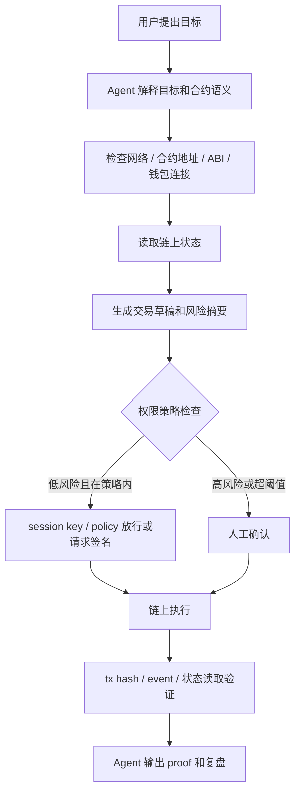

# Task: Week 2 方向深挖包与项目初步 Proposal

- **WCB Task ID**: `cmpkl6652nbgpmu012os75zfg`
- **WCB Task Title**: Week 2｜总交付｜方向深挖包与项目初步 Proposal
- **Points**: 40
- **Submitted**: 草稿中
- **Handbook 关联章节**:
  - [Agent Wallet](https://aiweb3.school/zh/handbook/bridge/agent-wallet/)
  - [Web3 Tool Use](https://aiweb3.school/zh/handbook/bridge/web3-tool-use/)
  - [Machine Payment](https://aiweb3.school/zh/handbook/bridge/machine-payment/)
  - [AI Security](https://aiweb3.school/zh/handbook/bridge/ai-security/)

## 一句话总结

我选择的 Week 2 主方向是 **Wallet / Permission / Safe Execution**，项目初步 proposal 是做一个“受限 Web3 Agent 助手”：它能解释合约、生成交易草稿、检查网络和权限、总结链上 proof，但高风险链上动作必须经过人工确认或智能账户策略放行。

## 1. AI x Web3 问题地图

问题地图详见：

- [`tasks/week2-problem-map-direction.md`](./week2-problem-map-direction.md)

覆盖方向：

1. Payment / Commerce / Settlement
2. Identity / Reputation / Capability
3. Wallet / Permission / Safe Execution
4. Privacy / Security / Sovereignty
5. Dev Tooling / Agent Workflow
6. Governance / Coordination / Public Goods

## 2. 方向选择说明

主方向：**Wallet / Permission / Safe Execution**

为什么不是纯 AI 问题：

- AI 可以理解用户目标、解释 ABI、生成交易草稿，但不能用 prompt 解决资产权限边界。
- 链上动作需要签名、账户模型、权限策略、预算限制和可验证执行记录。

为什么不是纯 Web3 问题：

- 传统钱包只展示交易和签名，不理解用户自然语言目标。
- Agent 可以帮助用户理解交易语义、识别风险、生成 proof、复盘失败原因。

核心判断：

> Agent Wallet 的关键不是让 Agent “自动帮我点确认”，而是让 Agent 在策略边界内工作，并在资产动作前停下来让人或智能账户策略确认。

## 3. 问题拆解

### 参与方

| 角色 | 作用 | 风险 |
|---|---|---|
| 用户 | 提出目标，最终控制资产和授权 | 看不懂交易、误签名 |
| Agent | 理解目标、解释合约、生成草稿、总结 proof | 被 prompt injection、越权执行 |
| 钱包 / 智能账户 | 管理签名、权限和执行策略 | 策略配置错误、私钥泄漏 |
| 合约 | 执行链上规则 | 恶意合约、ABI 不匹配、权限后门 |
| RPC / 节点 | 广播交易和读取链上状态 | 网络错误、数据延迟 |
| 区块浏览器 / 索引器 | 验证 tx、event 和状态变化 | 索引延迟、前端误读 |

### 流程

### AI 作用

- 解释 ABI 和函数语义。
- 判断动作风险等级。
- 生成交易草稿和人类可读摘要。
- 识别网络不匹配、未知合约、授权风险。
- 总结 tx hash、event、状态变化和失败原因。

### Web3 机制

- 钱包签名。
- 智能账户 / ERC-4337。
- Safe 多签。
- session key。
- guard / policy。
- tx hash / event / 区块浏览器验证。

### 自动化边界

可自动化：

- 只读查询。
- ABI 解释。
- 网络 / 地址 / allowance 检查。
- 低风险测试网动作草稿。
- proof 总结。

必须人工确认：

- 主网写交易。
- 任何 approve / permit / setApprovalForAll。
- 资金转移。
- owner / admin / upgrade / withdraw。
- 超预算或未知合约调用。

## 4. 项目初步 Proposal

### 项目名称

**Bounded Web3 Agent**

### 目标用户

- Web3 初学者：看不懂钱包弹窗、ABI、合约地址和交易状态。
- AI x Web3 builder：需要一个可解释、可限制、可验证的 Agent 钱包交互流程。
- 小团队 / DAO operator：希望 Agent 帮忙准备交易和总结 proof，但不希望 Agent 直接控制资金。

### 真实场景

用户想让 Agent 帮自己调用一个合约，例如：

- 在测试网调用 Counter `increment()`。
- 查看 ERC-20 余额和 allowance。
- 准备小额 x402 paywall 支付。
- 总结一次 Safe 多签交易的风险。

Agent 不直接签名，而是生成一份交易草稿和风险摘要，用户或智能账户策略确认后才执行。

### 最小功能

1. 输入合约地址、ABI、目标网络和用户目标。
2. Agent 输出函数解释和风险等级。
3. 检查当前网络是否匹配。
4. 生成交易草稿：`to`、function、params、value、risk。
5. 标记是否必须人工确认。
6. 执行后输入 tx hash，Agent 总结 event 和状态变化。

### 不做什么

- 不托管私钥。
- 不读取助记词 / `.env` / API key。
- 不自动 approve。
- 不自动执行主网交易。
- 不承诺判断所有恶意合约。

### 验证方式

- 测试网 Counter / WETH9 demo。
- 使用 Blockscout 验证 tx hash、event 和状态变化。
- 用一组风险 case 测试：
  - 网络不匹配。
  - 未知合约。
  - approve unlimited。
  - 超预算支付。
  - owner/admin 操作。

### 主要风险

| 风险 | 处理 |
|---|---|
| Agent 被 prompt injection | 工具权限隔离，高风险动作人工确认 |
| 用户盲签 | 强制展示人类可读摘要 |
| 错误网络 / 地址 | 网络和地址检查，不匹配停止 |
| 授权过大 | 禁止自动 unlimited approve |
| proof 虚假 | 必须用 tx hash、event、状态读取验证 |

### 可能赛道

- Wallet / Permission
- AI Security / Privacy
- Dev Tooling
- Agentic Commerce / Payment（后续扩展）

### Week 3 下一步

- 把流程做成一个最小网页或 CLI demo。
- 先支持只读合约解释和交易草稿生成。
- 接入一个测试网 Counter 合约。
- 增加风险规则表。
- 输出 proof report。

## 5. 参考资料清单

| 资料 | 帮助判断什么 |
|---|---|
| AI x Web3 Handbook - Agent Wallet | 理解 Agent Wallet 的授权、撤销、追踪和边界 |
| AI x Web3 Handbook - Web3 Tool Use | 理解 Agent 调用链上工具的风险 |
| Ethereum Account Abstraction / ERC-4337 | 理解智能账户和 session key 的基础 |
| Safe 文档 | 理解多签、模块和 guard / policy 的意义 |
| OpenZeppelin Contracts | 理解权限组件 Ownable / AccessControl / Pausable |
| Blockscout / Etherscan | 验证 tx、event、合约源码和链上状态 |

## 6. 主方向深挖包

### 典型场景

用户说：“帮我把这个测试网合约的 `increment()` 调一次，并告诉我有没有成功。”

Agent 应该：

1. 识别这是写操作。
2. 检查目标网络是否为 Sepolia。
3. 读取合约 ABI。
4. 生成交易草稿。
5. 要求用户钱包确认。
6. 根据 tx hash 和 event 验证结果。

### 反例

用户说：“帮我 approve 这个合约可以花我的 USDC，方便以后自动付款。”

Agent 不应该直接执行。它必须：

- 识别这是授权动作。
- 展示 spender、token、额度、期限、风险。
- 如果是 unlimited approve，默认拒绝或要求强确认。
- 建议最小额度和可撤销方案。

### 关键风险

- 私钥 / session key 失控。
- 授权额度过大。
- 合约白名单不严。
- 网络错误。
- Agent 被恶意网页诱导。
- 用户看不懂交易。

### 最小验证计划

1. 用 Counter 合约测试低风险写操作。
2. 用 ERC-20 `balanceOf` 测只读操作。
3. 用模拟 approve case 测高风险拦截。
4. 用错误网络 case 测 UI / Agent 是否停止。
5. 用 tx hash 生成 proof report。

## 7. 方向 Backlog

| 方向 | 暂时不选原因 |
|---|---|
| Payment / Commerce | 很重要，但没有 Wallet / Permission 边界会先变成乱付款问题 |
| Governance / Coordination | 更偏信息总结和协作流程，链上资产风险没有 Wallet 方向直接 |
| Identity / Reputation | 需要更多 DID / attestations 背景，当前基础还不够 |

## AI 辅助说明

本 proposal 由 AI 基于我的 Week 1 学习成果、Week 2 问题地图和 Agent 权限策略草拟。我人工复核了主方向、自动化边界和风险点。本文不包含私钥、助记词、API key、token、`.env` 或真实资金账户信息。
