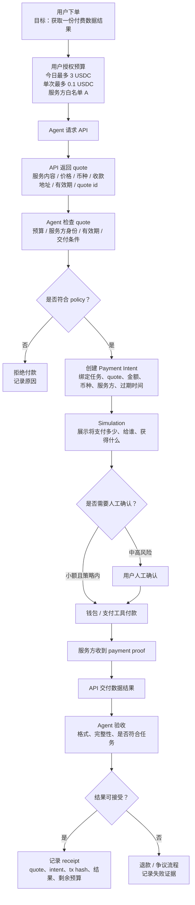

# Task: 最小支付与商业流程拆解

- **WCB Task ID**: `cmpkl64w9nbg5mu01jev746ru`
- **WCB Task Title**: Week 2｜Payment / Commerce｜最小支付与商业流程拆解
- **Points**: 20
- **Submitted**: 待提交
- **Handbook 关联章节**:
  - [Machine Payment](https://aiweb3.school/zh/handbook/bridge/machine-payment/)
  - [Settlement and Escrow](https://aiweb3.school/zh/handbook/bridge/settlement-and-escrow/)
  - [Agent Wallet](https://aiweb3.school/zh/handbook/bridge/agent-wallet/)

## 一句话总结

Machine Payment 不是“Agent 会转账”，而是把报价、预算授权、付款意图、执行、交付、验收、结算、退款 / 争议和收据记录拆成可检查、可验证、可追踪的流程。

## 场景选择

**场景：Agent 购买付费数据 API**

用户希望 Agent 帮自己完成一个研究任务，需要调用一个付费数据 API。API 服务方按次收费，每次调用 `0.1 USDC`，quote 有效期 5 分钟。用户授权 Agent 今天最多花 `3 USDC`，只能调用白名单 API Provider A。

这个场景足够小，但覆盖了 Payment / Commerce 的关键问题：

- 谁下单：用户。
- 谁执行：Agent。
- 谁验收：Agent 初步验收，用户可复核。
- 谁付款：用户的钱包 / Agent Wallet 在授权范围内付款。
- 谁仲裁：最小版本先用 receipt + 日志人工复核；高价值版本可加入 escrow / dispute。

## 完整流程

## 关键对象

### 1. Budget

预算不是一句“别花太多”，而是系统能检查的 policy：

| 维度 | 设置 |
|---|---|
| 全局预算 | 今日最多 3 USDC |
| 单次上限 | 每次最多 0.1 USDC |
| 服务方范围 | 只允许 API Provider A |
| 频率限制 | 每分钟最多 1 次，每日最多 30 次 |
| 网络 / token | 指定链上的 USDC |
| 紧急停止 | 连续失败 3 次自动暂停 |

### 2. Quote

合格 quote 至少包含：

| 字段 | 作用 |
|---|---|
| quote id | 后续对账和争议引用 |
| 服务内容 | Agent 买的到底是什么 |
| 价格 | 本次调用需要多少钱 |
| 币种 | USDC / USDT / 原生 token，不能只写 0.1 |
| 收款地址 | 付款给谁 |
| 有效期 | 防止过期报价继续被使用 |
| 交付条件 | 服务方承诺返回什么 |
| 退款条件 | 失败时如何处理 |
| 服务方签名 / 来源 | 证明 quote 来自真实服务方 |

### 3. Payment Intent

Payment Intent 不是已经付款，而是“这次付款被授权的上下文”：

| 字段 | 示例 |
|---|---|
| 用户目标 | 获取某数据 API 的结果 |
| 服务方 | API Provider A |
| quote 引用 | `quote-2026-05-27-001` |
| 最大金额 | 0.1 USDC |
| 总预算 | 今日 3 USDC |
| 链 / token | Sepolia USDC 或指定测试 token |
| 有效期 | 5 分钟 |
| 是否允许自动重试 | 否，失败后要求确认 |
| 是否需要人工确认 | 超预算 / 新服务方 / 授权动作需要 |

### 4. Settlement / Receipt

Settlement 是实际结算：

- 钱包或支付工具付款。
- 服务方收到 payment proof。
- API 交付结果。
- 系统记录 receipt。

Receipt 至少记录：

- quote id。
- payment intent id。
- tx hash / payment proof。
- 服务结果摘要。
- 时间戳。
- 剩余预算。
- 成功 / 失败 / 退款 / 争议状态。

## 正常 / 失败 / 争议 Case

| Case | 发生什么 | 系统应该怎么做 |
|---|---|---|
| 正常 | quote 0.1 USDC，服务方 A，预算充足 | 自动付款或轻确认，记录 receipt |
| Quote 过期 | quote 超过 5 分钟 | 拒绝使用，要求重新报价 |
| 超预算 | 本次 0.5 USDC 或今日预算已用完 | 拒绝付款，不诱导用户临场破例 |
| 非白名单服务方 | 收款地址不是 Provider A | Guard 拦截，不付款 |
| 服务未交付 | 付款后 API 没返回结果 | 进入退款 / 争议流程，记录证据 |
| 重复付款 | pending 状态下 Agent 再次付款 | 阻止重复提交，等待上一笔结果 |

## x402 / MPP 简要比较

| 协议 / 方向 | 解决哪一段 | 对本场景的意义 |
|---|---|---|
| x402 | API / 内容服务如何通过 HTTP 402 返回付款要求，客户端付款后带 proof 重试请求 | 适合“Agent 请求 API -> API 要求付款 -> Agent 检查预算并付款 -> 重新请求” |
| MPP | 机器之间如何发现服务、获取报价、授权支付、结算和返回收据 | 更完整地表达 machine-to-machine 商业流程，不只是一笔链上转账 |

我的理解：

- x402 更像“支付入口协议”，把付款需求嵌进 HTTP 流程。
- MPP 更像“机器商业流程协议”，覆盖发现、报价、付款、交付和收据。

## 和 Wallet / Permission 主方向的关系

Payment / Commerce 依赖 Wallet / Permission。

如果没有预算、白名单、session key、policy、guard、simulation 和 revocation，Agentic Commerce 就会变成“Agent 可以乱花钱”。所以我把 Payment / Commerce 作为副方向，服务于主方向 **Wallet / Permission / Safe Execution**。

## AI 辅助说明

本文件由 AI 根据 WCB Week 2 Payment / Commerce 任务要求和 Machine Payment Handbook 内容起草。我人工确认了核心边界：Agent 可以在预算和白名单内准备付款，但不能拥有无限支付能力；付款必须留下 quote、intent、payment proof、receipt 和失败 / 争议记录。
