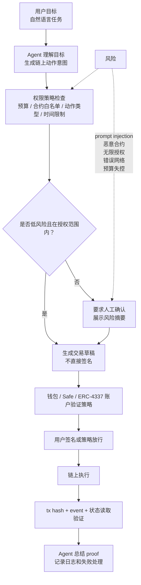

# Task: AI x Web3 问题地图与主方向选择

- **WCB Task ID**: `cmpkl64ppnbg2mu01renief9v`
- **WCB Task Title**: Week 2｜方向研究｜AI × Web3 问题地图与主方向选择
- **Points**: 20
- **Submitted**: 待提交
- **Handbook 关联章节**:
  - [Web3 Tool Use](https://aiweb3.school/zh/handbook/bridge/web3-tool-use/)
  - [Agent Wallet](https://aiweb3.school/zh/handbook/bridge/agent-wallet/)
  - [Machine Payment](https://aiweb3.school/zh/handbook/bridge/machine-payment/)
  - [AI Security](https://aiweb3.school/zh/handbook/bridge/ai-security/)

## 一句话总结

我的 Week 2 主方向选择为 **Wallet / Permission / Safe Execution**：研究 AI Agent 如何在不拿走用户完整私钥控制权的前提下，安全发起链上动作，并通过权限边界、人工确认和链上验证降低风险。

## AI x Web3 问题地图

| 方向 | 典型问题 | AI 作用 | Web3 机制 | 为什么是交叉问题 |
|---|---|---|---|---|
| Payment / Commerce / Settlement | Agent 能否为信息、API、内容或服务自动付费？ | 判断任务、选择服务、生成支付意图、核对结果 | 钱包、稳定币、x402、escrow、链上收据 | AI 负责决策和执行意图，Web3 负责付款、结算和可验证收据 |
| Identity / Reputation / Capability | 如何判断一个 Agent 是谁、能做什么、过去做得怎么样？ | 生成 profile、能力声明、任务历史摘要 | DID、链上 attestations、reputation registry | AI 身份需要语义描述，Web3 提供可验证记录 |
| Wallet / Permission / Safe Execution | Agent 能不能替用户发起链上动作？边界在哪里？ | 解释交易、生成草稿、监控状态、总结 proof | EOA、Safe、ERC-4337、session key、policy / guard | AI 需要动作能力，Web3 资产动作必须受权限和签名约束 |
| Privacy / Security / Sovereignty | Agent 如何处理敏感数据、secret 和 prompt injection？ | 识别风险、隔离工具、解释攻击路径 | 本地密钥、权限分层、TEE/ZK/链上审计记录 | AI 容易被注入和越权，Web3 secret / 资产风险更高 |
| Dev Tooling / Agent Workflow | Agent 如何帮助开发、测试、部署和排查合约？ | 解释 ABI、生成测试、排查 revert、总结权限 | Hardhat、Foundry、viem、wagmi、Blockscout | AI 提升效率，Web3 工具链提供可复现和可验证约束 |
| Governance / Coordination / Public Goods | AI 能否帮助 DAO 总结提案、协调投票和分配资金？ | 总结提案、识别争议、生成投票建议 | Snapshot、on-chain voting、multisig、grant records | AI 处理信息过载，Web3 处理公开决策和资金执行 |

## 两个候选方向拆解

### 候选 A: Wallet / Permission / Safe Execution

**为什么不是纯 AI 问题：**

纯 AI 可以解释交易和生成操作建议，但无法解决“谁有权动资产”“授权边界是什么”“执行结果如何验证”这些问题。只靠 prompt 约束 Agent 不乱来是不够的，因为资产动作需要密码学签名、权限策略和链上记录。

**为什么不是纯 Web3 问题：**

传统钱包只处理签名和交易，不理解用户自然语言目标，也不会主动解释交易语义、识别 prompt injection、生成风险摘要或总结链上 proof。Agent 参与后，钱包从“签名工具”变成“带语义层的执行边界”。

**我关心的核心问题：**

> 如何让 Agent 帮用户准备链上动作，但只在预算、白名单、动作类型和人工确认阈值内执行？

### 候选 B: Payment / Commerce / Settlement

**为什么不是纯 AI 问题：**

AI 可以选择服务、判断价格和生成购买意图，但不能自己创造可信结算。服务方需要知道是否已付款，用户需要知道是否真的收到服务，双方都需要可验证收据。

**为什么不是纯 Web3 问题：**

链上支付可以完成转账，但不知道“该买什么、为什么买、服务是否满足需求”。Agent 的价值在于理解任务、比较选项和触发支付流程。

**我关心的核心问题：**

> Agent 自主支付时，怎样防止乱花钱、重复付款、被恶意 paywall 欺骗或无法验证服务交付？

## 主方向选择

我选择 **Wallet / Permission / Safe Execution** 作为 Week 2 主线。

选择原因：

1. 它和我 Week 1 的学习路径最连贯：钱包、EOA、智能账户、多签、ABI、dev-stack、签名和人工确认都已经学过。
2. 它和我的长期方向最相关：Agent Wallet / AI Agent 代管资产 / 受限 Web3 助手。
3. 它能自然连接 Week 2 后续任务：Agent Profile、权限策略、Threat Model、方向深挖包和 Proposal。
4. 它比单纯 Payment 更底层：没有安全权限边界，任何 Agentic Commerce 都会变成“AI 乱花钱”的风险。

## 主方向问题地图

## 后续拆解问题

接下来我会围绕主方向继续拆：

1. Agent 可以自动做哪些动作？
2. 哪些动作必须人工确认？
3. 预算、合约白名单、动作类型、时间窗口应该怎么表达？
4. ERC-4337 / Safe / guard / policy 分别解决什么风险？
5. 如果 Agent 失败、交易失败或被 prompt injection，应该如何停止和追责？

## 关联学习

- Week 1 流程图：[`tasks/week1-ai-web3-flow.md`](./week1-ai-web3-flow.md)
- Dev Stack 学习：[`daily/2026-05-27.md`](../daily/2026-05-27.md)
- EOA / 智能账户 / 多签比较：[`tasks/week1-account-permissions-comparison.md`](./week1-account-permissions-comparison.md)

## AI 辅助说明

本文件由 AI 根据 WCB Week 2 任务要求、我的 Week 1 学习笔记和当前主方向偏好起草。我人工确认主方向选择为 Wallet / Permission / Safe Execution，并会在后续任务中继续补充权限策略和 threat model。
